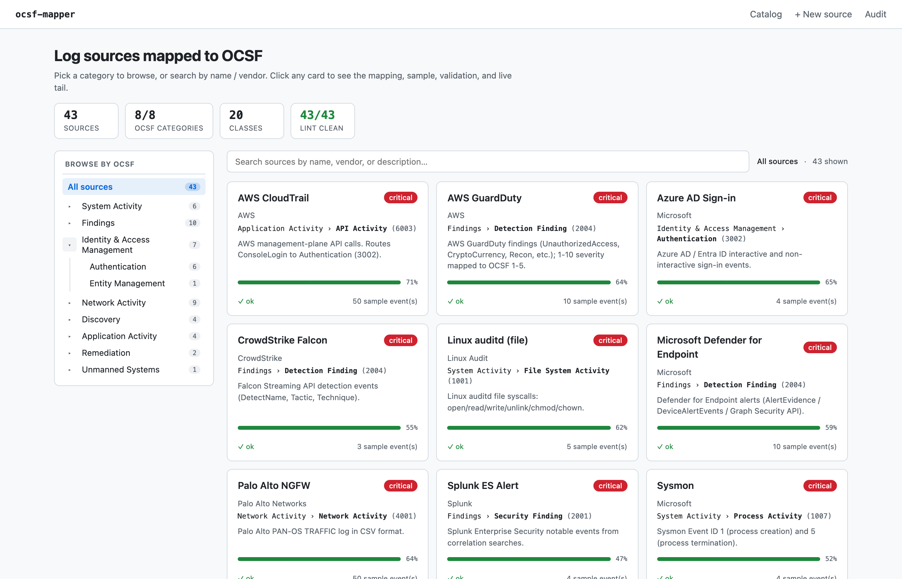
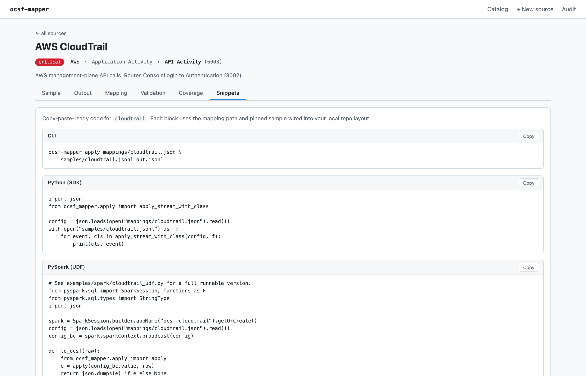
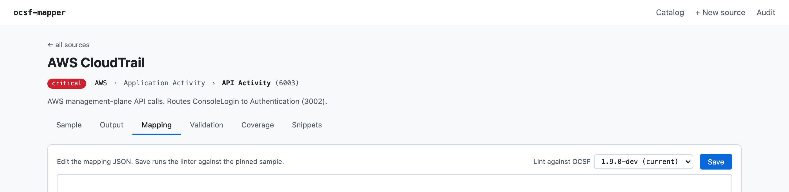
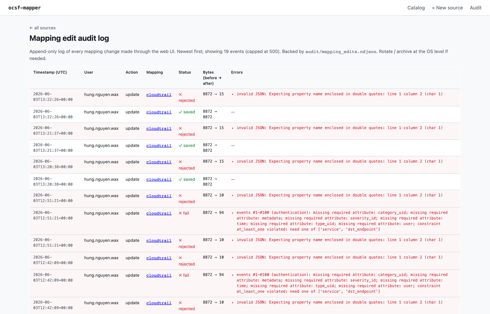

# ocsf-parse

Self-service tool that maps any log source into [OCSF](https://github.com/ocsf/ocsf-schema)
events through a small declarative JSON DSL. One Python engine, JSON config
per source, master-data catalog, CI-linted, schema-validated, with a local
web UI and LLM-assisted onboarding.

[](https://github.com/SauNu84/ocsf-parse/actions/workflows/ci.yml)

## What it does

**43 reference mappings**, **20 OCSF event classes**, **8 of 8 OCSF
categories** — from Windows Event Log / Sysmon / auditd through CloudTrail /
Okta / Azure AD / Duo / Defender / GuardDuty to Suricata / Wazuh /
CrowdStrike / Vault / PagerDuty. Each mapping ships with a paired sample,
is lint-checked on every PR, and validates against the vendored OCSF schema.

| OCSF category | Classes covered | Sources |
|---|---|---|
| System Activity | `file_activity`, `kernel_activity`, `process_activity`, `scheduled_job_activity`, `registry_key_activity` | auditd_file, dlp_events, falco_kernel, sysmon_process, cron, windows_registry |
| Findings | `security_finding`, `detection_finding`, `vulnerability_finding` | wazuh, splunk_es_alert, crowdstrike_falcon, suricata_alert, qualys_scan, ueba_alert, cef_generic, leef_generic, **aws_guardduty**, **microsoft_defender** |
| IAM | `authentication`, `entity_management` | okta, sshd, cloudtrail (ConsoleLogin), windows_event_log, azure_ad_signin, slack_audit, gitlab_audit, **duo_security** |
| Network | `network_activity`, `http_activity`, `dns_activity`, `email_activity` | nginx, apache, cloudflare, palo_alto, vpc_flow_logs, waf_logs, zeek_dns, m365_email, google_workspace |
| Discovery | `inventory_info`, `config_state`, `device_config_state_change` | osquery_inventory, aws_config, jamf_inventory, prisma_cloud |
| Application Activity | `api_activity` | cloudtrail (non-login), github_audit, k8s_audit, **hashicorp_vault** |
| Remediation | `remediation_activity` | soar_remediation, **pagerduty** |
| Unmanned Systems | `drone_flights_activity` | drone_telemetry |

Browse the master-data view with `ocsf-mapper catalog` or
[`catalog.json`](./catalog.json).



## Quickstart

> **First time here?** Read [`QUICKSTART.md`](./QUICKSTART.md) — a
> 5-minute concrete walkthrough showing exactly what comes out
> when you point this at your logs. Comes back here when you want
> the full install / CLI / SDK reference.

### From PyPI

```bash
pip install 'ocsf-mapper[web,parquet,fast]'
ocsf-mapper list
```

### From source (for development)

```bash
git clone --recurse-submodules https://github.com/SauNu84/ocsf-parse
cd ocsf-parse
pip install -e '.[dev,web,parquet,fast]'         # full feature set incl. orjson
scripts/setup_schema_versions.sh                 # pin OCSF 1.7.0 + 1.8.0 worktrees
```

### From Docker (zero-install)

```bash
docker run --rm -p 8000:8000 ghcr.io/saunu84/ocsf-mapper:0.4.4
# → web UI on http://127.0.0.1:8000

# or pin to "latest" tag:
docker run --rm ghcr.io/saunu84/ocsf-mapper:latest list
```

> `[fast]` pulls in `orjson` — 5-10× faster JSON parse/dump than stdlib.
> Drop-in via `ocsf_mapper._fastjson`; falls back to stdlib if absent.

### CLI

```bash
# Browse what's available
ocsf-mapper list                       # table of mappings
ocsf-mapper catalog                    # master-data: vendor + priority + OCSF class

# Map a log to OCSF events (sink inferred from output extension)
ocsf-mapper apply mappings/cloudtrail.json samples/cloudtrail.jsonl out.jsonl
ocsf-mapper apply mappings/okta.json       samples/okta.jsonl       out.csv
ocsf-mapper apply mappings/sshd.json       samples/sshd.log         # → stdout

# Pipe stdin → stdout
cat samples/cloudtrail.jsonl | ocsf-mapper apply mappings/cloudtrail.json - | jq .

# Partitioned Parquet for AWS Security Lake
ocsf-mapper apply mappings/cloudtrail.json samples/cloudtrail.jsonl out/ --sink security-lake
# → out/<class_uid>/eventDay=YYYYMMDD/part-NNNNN.parquet

# tail -f a live log
ocsf-mapper tail mappings/nginx.json /var/log/nginx/access.log out.jsonl

# Validate already-OCSF events
ocsf-mapper validate out.jsonl authentication

# CI gate — re-lint every mapping against its pinned sample
ocsf-mapper lint                       # exits 0 iff all mappings pass

# LLM-assisted mapping draft (needs ANTHROPIC_API_KEY or OPENAI_API_KEY)
ocsf-mapper generate my_new_source samples/my_new_log.jsonl mappings/my_new.json

# Detect breaking OCSF schema changes before a submodule bump bites
ocsf-mapper schema-diff [<git-ref>]    # default: HEAD~1 of ocsf-schema submodule

# Throughput diagnostic: per-phase timing (parse / route / map / write)
ocsf-mapper benchmark mappings/cloudtrail.json samples/cloudtrail.jsonl

# Scale up: fan out across N worker processes (linear speedup to CPU count)
ocsf-mapper apply mappings/cloudtrail.json input.log out.jsonl --workers 8

# Redact PII before writing (email / ipv4 / ssn / phone / jwt / Luhn-valid ccn)
ocsf-mapper apply mappings/X.json input.log out.jsonl --redact

# Local web UI (127.0.0.1 only) — includes live-tail mode on the Output tab
ocsf-mapper serve                      # → http://127.0.0.1:8000
```

For a 10 TB-class workload, combine `--workers N` with `--sink security-lake`
and the streaming SecurityLakeSink (auto-rolls part files every 50 000 events
per partition). See [§"At scale"](#at-scale) below for the architecture.

If you cloned without `--recurse-submodules`:

```bash
git submodule update --init --recursive
```

### Web UI

`ocsf-mapper serve` launches a FastAPI + HTMX + Monaco app on `127.0.0.1`.

- **Homepage** — two-pane catalog: KPI strip (sources / categories /
  classes / lint-clean) + collapsible OCSF category tree on the left,
  live-search + filtered card grid on the right. Filter state syncs to
  the URL hash so views are shareable.
- **Per-source page** — six HTMX-swappable tabs:
  - *Sample* — raw lines of the pinned sample.
  - *Output* — drop any log file → side-by-side raw / mapped OCSF /
    per-event validation.
  - *Mapping* — Monaco JSON editor with a **"Lint against OCSF"
    dropdown** (default 1.9.0-dev / pinned 1.8.0 / 1.7.0). Save runs
    the linter against the pinned sample at the chosen schema version
    server-side and only writes the file if it passes. Three AI-assist
    buttons sit next to Save:
    - **✨ Fix with AI** — enables after a failed save. Sends the
      current mapping + lint errors + first 5 sample events to the
      configured LLM provider, drops the repaired JSON into Monaco.
    - **♻ Regenerate** — always enabled. Asks for a fresh draft from
      the pinned sample (same two-phase flow as `/new` wizard); useful
      when the current mapping is past saving.
    - **💡 Suggest** — coverage-aware. Takes a lint-clean mapping,
      computes the missing required + recommended OCSF attributes, and
      asks the LLM to ADD field mappings for them while preserving
      every existing target. Bumps coverage without rewriting.

    All three need `ANTHROPIC_API_KEY` or `OPENAI_API_KEY` set (or
    `OCSF_LLM_PROVIDER=fixture` for offline dev). They surface a 503
    with a setup hint instead of crashing when no key is found.
    Successful results are cached in-memory (LRU, cap 16) keyed on the
    input — clicking the same button twice on the same content returns
    the previous draft instantly, no second API call. None of these
    write to disk — Save is always the final linter gate.
  - *Validation* — full validator report across the pinned sample with a
    recurring-issues rollup.
  - *Coverage* — per-class bars (required + recommended attrs populated)
    + lists of missing fields.
  - *Snippets* — copy-paste-ready CLI / Python SDK / PySpark UDF /
    Pandas blocks for the current mapping, templated with the actual
    mapping path and pinned sample.
- **`/new` wizard** — upload a sample, fill in vendor / priority, the
  generator drafts a mapping via the configured LLM provider, you review
  the JSON in Monaco, hit save, the linter gate runs before the file is
  written.





### Audit trail

Every save through the Mapping tab or the `/new` wizard appends a record
to `audit/mapping_edits.ndjson` (gitignored — per-install operational
state). The `/audit` page surfaces the last 500 events with timestamp,
user, mapping, lint status, byte delta, and any errors — answers the
compliance question *"who changed `cloudtrail.json` last Tuesday?"* without
shelling into `jq`.



## SDK

```python
from ocsf_mapper import apply_stream, validate, list_mappings
from ocsf_mapper.sinks import JsonlSink
from ocsf_mapper.sinks.security_lake import SecurityLakeSink, infer_schema_from
from ocsf_mapper.coverage import coverage
from ocsf_mapper.stream import stream_apply
from ocsf_mapper.parallel import apply_parallel
from ocsf_mapper.benchmark import benchmark
from ocsf_mapper.redact import RedactingSink
import json

config = json.loads(open("mappings/cloudtrail.json").read())

# Batch
with JsonlSink("out.jsonl") as sink:
    sink.write_many(apply_stream(config, open("samples/cloudtrail.jsonl")))

# Partitioned Parquet for downstream Security Lake ingest. Streams to disk
# every flush_every events per (class_uid × eventDay) partition — memory
# is bounded regardless of input size.
schema = infer_schema_from(next(iter(apply_stream(config, open("samples/cloudtrail.jsonl")))))
with SecurityLakeSink("out_dir", flush_every=50_000, schema=schema) as sink:
    sink.write_many(apply_stream(config, open("samples/cloudtrail.jsonl")))

# Multi-process for 10 TB-class workloads
apply_parallel(config, "huge.log", "out.jsonl", n_workers=8, sink_kind="jsonl")

# Coverage scoring (what % of required + recommended attrs are populated)
print(coverage(config))

# Per-phase timing
print(benchmark(config, "samples/cloudtrail.jsonl"))

# PII redaction wrapper around any sink
with RedactingSink(JsonlSink("scrubbed.jsonl")) as sink:
    sink.write_many(apply_stream(config, open("samples/cloudtrail.jsonl")))

# Live tail
import threading
stop = threading.Event()
with JsonlSink("live.jsonl") as sink:
    stream_apply(config, "/var/log/cloudtrail.log", sink, stop=stop)
```

## At scale

For 10 TB-class workloads on a single box:

| Knob | Effect |
|---|---|
| `pip install ocsf-mapper[fast]` | orjson swap — 5-10× faster JSON parse/dump |
| `--workers N` | Linear speedup to CPU count |
| `--sink security-lake` | Streaming partitioned Parquet, memory bounded |
| `infer_schema_from(...)` + `schema=` | Skip pyarrow type re-inference per flush |

Combined: ~30-50× over the single-threaded baseline. On an 8-core box this
puts 10 TB at ~1-2 days instead of ~40 days. See
[`BENCHMARKS.md`](./BENCHMARKS.md) for per-mapping throughput numbers
and the phase breakdown that motivates the multi-process gain.

For genuinely large workloads, the tool is intended as a **mapping
*development*** environment — develop the JSON DSL config locally, then
ship the *same config* to a real distributed runtime (Spark / Flink /
Beam / Vector) for production. See [`DESIGN_DISTRIBUTED.md`](./DESIGN_DISTRIBUTED.md)
for the architecture: how the JSON DSL travels into a Spark UDF, a Flink
streaming job, or Vector/Fluentbit agents, plus CI-gate patterns for
schema-bump pre-flight and coverage drift.

## SIEM research notebook

For experimenting with the OCSF pipeline at realistic SOC volumes,
there's a notebook + synthetic-data generator:

```bash
# Generate 5-10 GB of synthetic OCSF events across 30 days, partitioned by
# class_uid + event_day (the AWS Security Lake layout). Includes 5 hand-
# injected incident scenarios (brute force, GuardDuty chain, Vault denied,
# lateral movement, MFA fraud).
python3 scripts/generate_synthetic_data.py --scale 8 --out data/synthetic/ocsf

# Open the 4-section research notebook:
#   §1 capacity / volume       §2 threat hunting
#   §3 detection-rule prototyping  §4 compliance evidence
jupyter lab notebooks/siem_exploration.ipynb
```

`data/` is gitignored; the dataset is regenerable in ~10–50 minutes
depending on `--scale`. See [`notebooks/README.md`](./notebooks/README.md)
for full details.

## Repository layout

```
mappings/                JSON DSL configs per log source
samples/                 Paired sample log files (used by lint and tests)
catalog.json             Master-data: vendor + priority + OCSF target per source
ocsf-schema/             Vendored ocsf/ocsf-schema (git submodule, pinned)
src/ocsf_mapper/
  apply.py               DSL executor + public apply()/apply_stream()
  ops.py                 11 op kinds (const, path, group, raw, lookup, time,
                          range, int, bool, expr, for_each)
  validate.py            Structural validator
  registry.py            Programmatic mapping inventory
  catalog.py             catalog.json reader + table printer
  coverage.py            Per-class completeness scoring
  lint.py                CI gate
  schema.py              OCSF schema loader (categories, classes, dictionary)
  generate.py            LLM-assisted two-phase mapping generator
  stream.py              tail -f-style streaming helpers
  providers/             LLM provider abstraction (Anthropic, OpenAI, fixture)
  sinks/                 Output destinations (jsonl, csv, parquet,
                          security-lake, stdout)
  web/                   FastAPI + Jinja2 + HTMX app
  cli.py                 ocsf-mapper CLI entry point
  parallel.py            apply_parallel: multi-process fan-out
  benchmark.py           Per-phase throughput diagnostic
  stream.py              tail -f-style streaming helpers
  schema_diff.py         Detect schema-bump breakage vs older git ref
  redact.py              PII redaction (email/ipv4/ssn/phone/jwt/ccn)
  _fastjson.py           orjson-or-stdlib JSON shim
scripts/
  generate_samples.py    Deterministic sample-data generator
  lint_mappings.py       Thin wrapper around python -m ocsf_mapper.lint
tests/                   pytest suite (346 tests, 90% coverage)
```

## Adding a new log source

1. Drop your sample (JSON / regex-parseable text) into `samples/<name>.<ext>`.
2. Write `mappings/<name>.json` per the DSL in [`PLAN.md`](./PLAN.md) §4 —
   *or* use `ocsf-mapper generate <name> samples/<name>.<ext>` (or the
   web UI's `/new` wizard) to draft one with LLM assistance.
3. Add an entry to `catalog.json` with vendor + priority + OCSF target.
4. `ocsf-mapper lint mappings/` — must exit 0.
5. `pytest` — must stay green.

## Status

All four foundation phases shipped; v0.4 release series (v0.4.0 → v0.4.4,
2026-06-03) added the AI authoring loop, OCSF schema versioning, a
two-pane homepage, and 5 new mappings.

- [x] **Phase A — SDK**: pip-installable package, CLI (12 subcommands —
      `apply`, `validate`, `list`, `catalog`, `lint`, `schema-diff`,
      `benchmark`, `diff`, `generate`, `replay`, `tail`, `serve`), 43
      reference mappings, master-data catalog, GitHub Actions CI on
      Python 3.9 / 3.11 / 3.12.
- [x] **Phase B — Web UI**: two-pane homepage (rail + tree + filter +
      KPIs), per-source page with 6 HTMX-swappable tabs (Sample,
      Output, Mapping with Monaco + AI assist, Validation, Coverage,
      Snippets), new-source wizard at `/new`, audit log view.
- [x] **Phase C — LLM-assisted onboarding**: Anthropic / OpenAI /
      fixture provider abstraction, two-phase generator
      (`suggest_classes` → `draft_mapping`), `ocsf-mapper generate`
      CLI, UI wizard with server-side lint gate.
- [x] **Phase D — Polish** (all subitems done): per-mapping coverage
      scoring, Security Lake Parquet sink, `tail -f` live streaming
      (CLI + SSE in UI), schema-bump diff, PII redaction, mapping
      comparison.
- [x] **Distribution (v0.3)**: PyPI publish workflow, Docker image
      pushed to GHCR, Spark UDF reference at `examples/spark/`,
      landing page deployed via GitHub Pages.
- [x] **Bucket B — additional mappings** (v0.3 + v0.4): GitHub /
      GitLab / Slack / K8s audit logs; CEF + LEEF generic parsers;
      Windows-extension `registry_key_activity`; SOAR + drone
      telemetry (closed OCSF categories 7 + 8); v0.4 batch added Duo,
      GuardDuty, Defender, Vault, PagerDuty.
- [x] **Bucket C — production engineering** (v0.3): Prometheus
      `/metrics`, audit log of mapping edits, replay tool, provider
      test mocks (~90% coverage), mapping versioning.
- [x] **Bucket D — AI authoring loop** (v0.4 series): ✨ Fix-with-AI,
      ♻ Regenerate, 💡 Suggest-improvements — all coverage-aware,
      cached (LRU 16, lifetime-of-process), no-provider 503 with a
      friendly setup hint instead of a crash.
- [x] **Bucket E — UI redesign** (v0.4 series): two-pane homepage,
      Snippets tab, OCSF schema version selector (1.7.0 / 1.8.0 /
      1.9.0-dev pinned as git worktrees), Monaco loading spinner +
      prefetch.
- [ ] **Phase E — distributed runtimes** (deferred): Flink streaming
      adapter, Vector / Fluentbit transpiler, Apache Beam adapter.

See [`CHANGELOG.md`](./CHANGELOG.md) for the per-version commit timeline
and [`PLAN.md`](./PLAN.md) for the original architecture and design
decisions, including per-bucket scope discussion.
